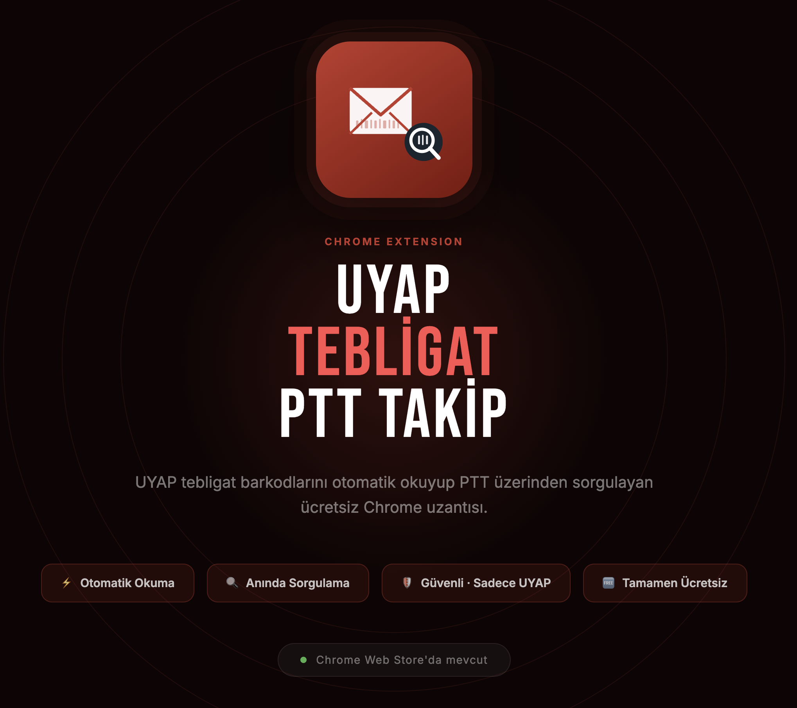
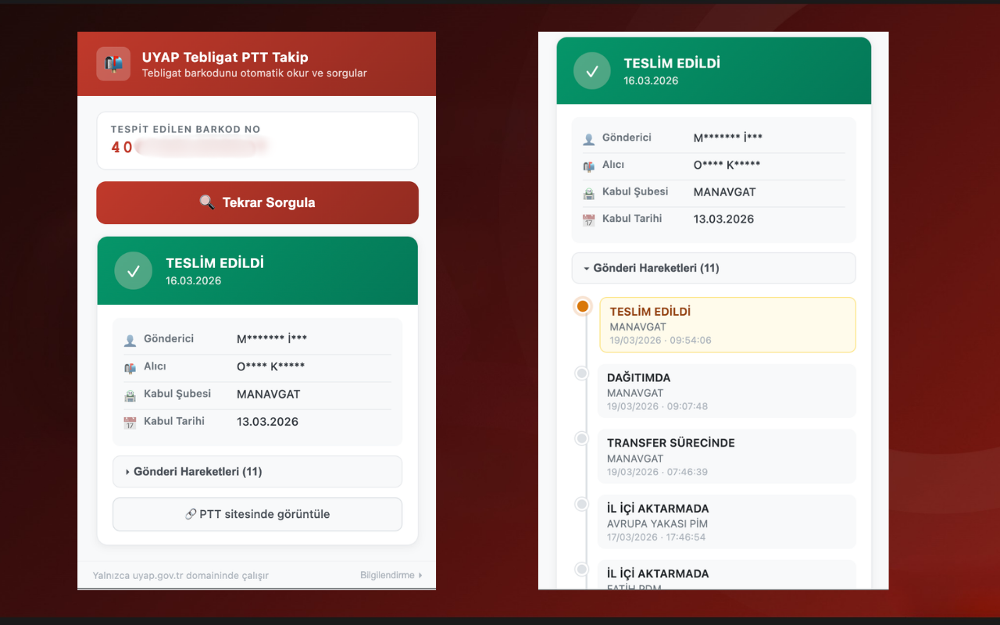

<p align="center">
  
</p>

# UYAP Tebligat PTT Takip — Chrome Eklentisi

UYAP'ta açık olan tebligat belgesinden PTT barkod numarasını otomatik okuyup PTT gönderi takip sorgusunu yapan Chrome eklentisi.

> **English:** A Chrome extension that automatically reads PTT barcode numbers from UYAP (Turkish Court System) documents and queries shipment tracking status via PTT (Turkish Postal Service).

---

## Ekran Görüntüsü

<p align="center">
  
</p>

---

## Gereksinimler

- Google Chrome 88+ (Manifest V3 desteği gereklidir)
- UYAP erişimi (tebligat belgesi açık olmalı)

---

## Kurulum

1. Bu klasörü bilgisayarına kaydet
2. Chrome'da `chrome://extensions/` adresine git
3. Sağ üstten **"Geliştirici modu"**nu aç
4. **"Paketlenmemiş öğe yükle"** butonuna tıkla
5. Bu klasörü seç → eklenti yüklenir

---

## Kullanım

1. UYAP'a giriş yap
2. Takip etmek istediğin **tebligatı aç** (PDF viewer açık olmalı)
3. Chrome araç çubuğundaki ikonuna tıkla
4. **"Tebligat Numarasını Oku ve Sorgula"** butonuna bas
5. Barkod otomatik okunur → PTT'den sorgu yapılır → Sonuç gösterilir

---

## Nasıl Çalışır?

```
[Butona tıkla]
  ↓
[content.js] → DOM'dan .rpv-core__text-layer-text span'larını okur
  ↓
Regex ile PTT barkod numarasını tespit eder (13 haneli sayı veya AA123456789TR formatı)
  ↓
[background.js] → gonderitakip.ptt.gov.tr'ye fetch atar
  ↓
[popup.html] → Sonucu gösterir (durum badge + hareket listesi + PTT linki)
```

---

## Proje Yapısı

```
uyap-ptt-extension/
├── manifest.json      # Eklenti yapılandırması (izinler, script tanımları)
├── popup.html         # Popup arayüzü (HTML + CSS)
├── popup.js           # Popup mantığı (butona tıklama, sonuç gösterme)
├── content.js         # Sayfa içeriğinden barkod okuma (DOM erişimi)
├── background.js      # PTT API sorgusu (service worker, CORS çözümü)
├── test-page.html     # Geliştirme/test için sahte UYAP sayfası
├── icons/             # Eklenti ikonları (16, 48, 128 px)
└── assets/            # README görselleri
```

---

## Test (UYAP Erişimi Olmadan)

UYAP erişiminiz yoksa `test-page.html` dosyasını kullanarak eklentiyi test edebilirsiniz. Bu sayfa, gerçek UYAP'taki DOM yapısını (`.rpv-core__text-layer-text` span'ları) simüle eder.

1. `manifest.json` dosyasındaki `host_permissions` ve `content_scripts.matches` alanlarına geliştirme izinlerini ekleyin:
   ```json
   "host_permissions": [
     "https://*.uyap.gov.tr/*",
     "https://*.ptt.gov.tr/*",
     "http://localhost/*",
     "file://*/*"
   ],
   "content_scripts": [
     {
       "matches": [
         "https://*.uyap.gov.tr/*",
         "http://localhost/*",
         "file://*/*"
       ],
       "js": ["content.js"]
     }
   ]
   ```
2. Eklentiyi `chrome://extensions/` üzerinden yükleyin
3. Eklenti detaylarından **"Dosya URL'lerine erişime izin ver"** seçeneğini açın
4. `test-page.html` dosyasını Chrome'da açın
5. Sayfadaki senaryo butonlarıyla farklı durumları test edin:
   - **Normal Barkod** — 13 haneli standart barkod
   - **UPU Format** — Uluslararası posta formatı (`RR...TR`)
   - **Çoklu Numara** — Birden fazla barkod (ilki alınır)
   - **Barkod Yok** — Barkod bulunamama senaryosu

> **Not:** Yayın sürümünde `localhost` ve `file://` izinleri bulunmaz. Test bittiğinde bu izinleri kaldırmayı unutmayın.

---

## Barkod Formatları (Desteklenen)

| Format | Örnek | Açıklama |
|--------|-------|----------|
| 13+ haneli sayı | `2789396419841` | Standart kargo barkodu |
| UPU formatı | `RR123456789TR` | Uluslararası posta |

---

## Önemli Notlar

- **Yalnızca `uyap.gov.tr` domaininde çalışır** — güvenlik için
- PTT'nin kamuya açık bir JSON API'si bulunmadığından `gonderitakip.ptt.gov.tr` scrape edilir
- PTT sayfasının HTML yapısı değişirse `background.js` içindeki `parseHTMLResponse()` fonksiyonunu güncellemeyi gerektirebilir
- CORS sorunlarını önlemek için sorgu `background.js` (service worker) üzerinden yapılır

---

## Sorun Giderme

**"Sayfada tebligat metni bulunamadı"**
→ PDF viewer henüz yüklenmemiş olabilir. Birkaç saniye bekleyip tekrar dene.

**"PTT'ye bağlanılamadı"**
→ İnternet bağlantını kontrol et. PTT sitesi zaman zaman down olabiliyor.

**"UYAP domaininde değilsiniz"**
→ Yalnızca uyap.gov.tr'de çalışır. UYAP tabında iken popup'ı aç.

---

## License

© 2026 Pınar Suvacoğlu — Licensed under [CC BY-NC 4.0](./LICENSE)

- Personal and educational use is free
- Contributions via pull requests are welcome
- Commercial use is **not permitted** without written permission
